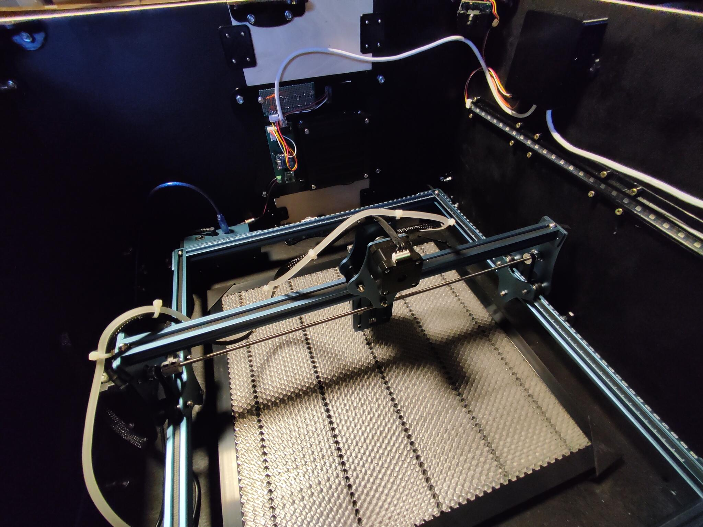
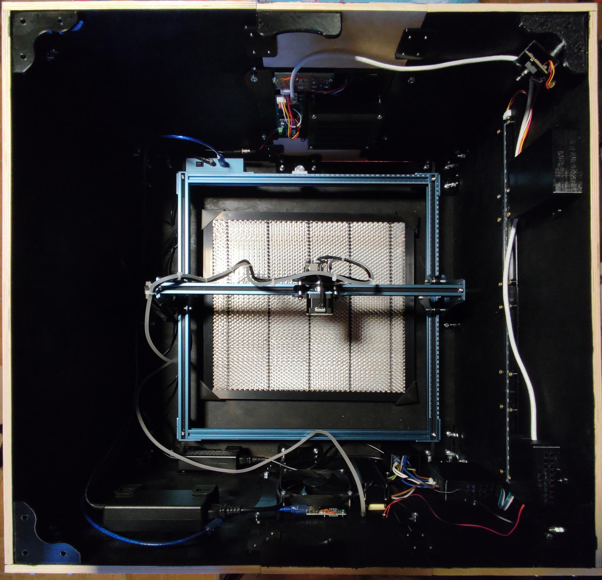
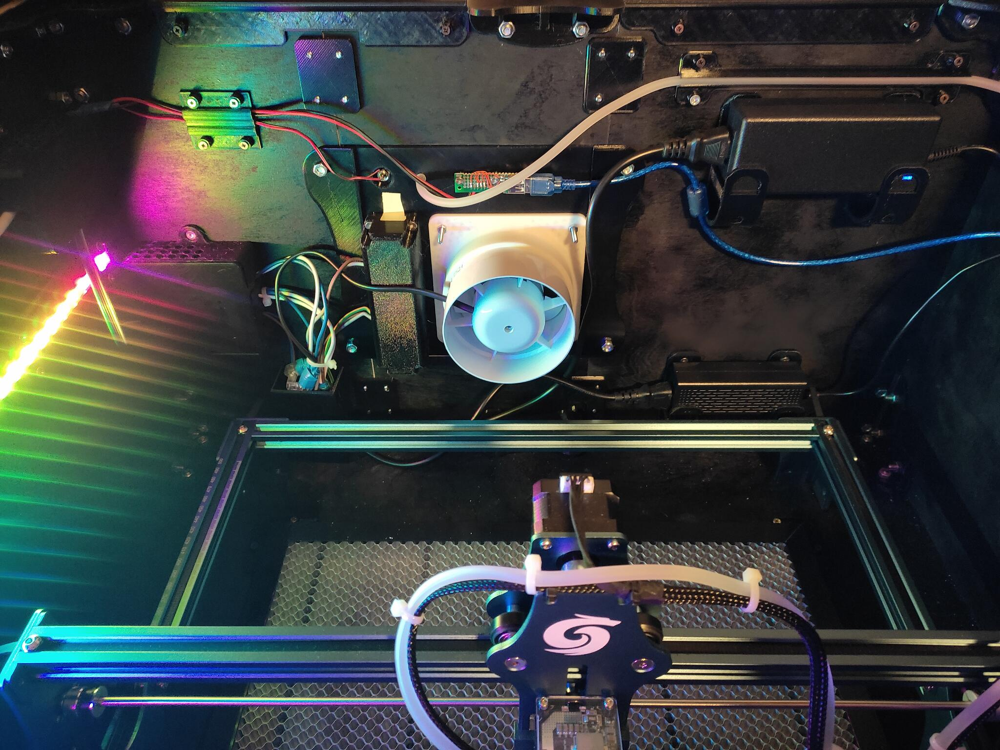

# Laser Engraving Machine Enclosure

This is an enclosure project to safely run a 450mm x 450mm laser engraving open frame machine.
The project was originally built around Sculpfun S9 but is suitable for all laser engraving machines with a footprint up to 450mm x 450mm.

Features:

- Full enclosure to protect from laser beam
- Air assist support
- Camera support to keep track of ongoing engraving/cutting jobs
- Internal lighting
- Fumes exhaust system
- Controlled by Wemos Lolin D1 mini
  - Pushbuttons and OLED display
  - Fumes exhaust system start/stop
  - Air assist start/stop
  - Laser engraver start/stop
- MQTT support (work in progress)

## Main structure

The main structure is built with 10mm-thick medium-density fiberboard (MDF) panels, spray-painted black.

## 3D Printed parts

The complete Fusion 360 project can be found in the [CAD folder](/CAD) and it can be opened in Autodesk Fusion 360.

3D parts should be printed using:

- Black PLA or PETG
- 20% infill
- 0.1mm layer width
- 4 walls
- No supports required for most parts

## Microcontroller

The [sketch](/sketch) can be flashed to Wemos Lolin D1 mini using Arduino 1.8.7 or later

NOTE: don't forget to use the provided User_Setup.h instead of the stock file that comes with the TFT_eSPI library

Required external libraries are:

- PCF8574 library by Renzo Mischianti - https://www.mischianti.org/2019/01/02/pcf8574_1-i2c-digital-i-o-expander-fast-easy-usage/
- APA102 by Pololu
- TFT_eSPI by Bodmer
- PubSubClient by Nick O'Leary
- NTPClient by Fabrice Weinberg

Display bitmaps have been generated using [LCD Image Converter](https://sourceforge.net/projects/lcd-image-converter/)

## Bill of Materials

### Main structure:

- 2x MDF boards 700mm x 700mm x 10mm
- 2x MDF boards 700mm x 400mm x 10mm
- 2x MDF boards 400mm x 300mm x 10mm
- 2x MDF boards 400mm x 200mm x 10mm
- 4x MDF boards 200mm x 100mm x 10mm
- Black spray paint ([RAL 9005](https://www.ralcolorchart.com/ral-classic/ral-9005-jet-black), approx 800ml needed)

### 3D-printed parts:

- 2kg black PLA or PETG filament

### Air Assist:

- 1x Hailea Air Compressor ACO-318 or equivalent (60L/min, 230V)
- Flexible air-line aquarium tubing, 4mm inner diameter, 6mm outer diameter

### Fumes exhaust system:

- 2x 120mm 12v PC fan
- 1x Airope BA 100mm Axial inline 100mm diameter fumes extractor fan or equivalent
- 1x Flexible Fume Hood Duct 102mm diameter

### Electronics:

Full schematics are [available here](/schematics). All boards built on single-sided protoboard.

#### Main board

- 1x Wemos Lolin D1 mini
- 1x MP1584EN (DC-DC 3A step-down)
- 1x PCF8574 (I2C I/O expansion module)
- 1x P82B715PN (I2C bus extender)
- 1x 2-pin PCB terminal block
- 1x RJ45 8p8c 90 degree angle PCB connector
- 1x 5-pin JST XH2.54 PCB terminal connector
- 1x 4-pin JST XH2.54 PCB terminal connector
- 1x 2-pin JST XH2.54 PCB terminal connector
- 1x 2n2222a transistor
- 3x 1kOhm 1/4w resistor
- 2x 430Ohm 1/4w resistor
- 2x 4.7kOhm 1/4w resistor
- 1x 1n4148 diode
- 1x 8pin DIP socket
- 1x 16pin DIP socket

#### Control and display board

- 1x IPS LCD 1.3" 240×240 RGB Display ST7789 (ie. https://protosupplies.com/product/ips-lcd-1-3-240x240-rgb-display-st7789/)
- 3x 4-pin tactile pushbutton momentary switch with switch cap (ie. https://www.amazon.com/TWTADE-Momentary-Tactile-Button-12x12x12mm/dp/B07CG7VTGD)
- 1x 5-pin JST XH2.54 PCB terminal connector
- 3x 0.1uF capacitor
- 3x 100kOhm 1/4w resistor
- 3x 10kOhm 1/4w resistor

#### Port expander board

- 1x MP1584EN (DC-DC 3A step-down)
- 1x PCF8574 (I2C I/O expansion module)
- 1x P82B715PN (I2C bus extender)
- 2x RJ45 8p8c 90 degree angle PCB connector
- 1x 3-pin JST XH2.54 PCB terminal connector
- 1x 4-pin JST XH2.54 PCB terminal connector
- 2x 2n2222a transistor
- 6x 1kOhm 1/4w resistor
- 2x 430Ohm 1/4w resistor
- 2x 4.7kOhm 1/4w resistor
- 1x 1n4148 diode
- 1x 8pin DIP socket
- 1x 16pin DIP socket

#### Port splitter board

- 1x RJ45 8p8c 90 degree angle PCB connector
- 1x 2-pin JST XH2.54 PCB terminal connector

#### Relay board

- 1x 5v Relay board 4 channels

#### Other / miscellaneous

- 1x APA102 RGB LED weatherproof strip (38 LEDs needed)
- 1x 1/3" 480TVL CCD, 12v color camera board with analog output or equivalent (ie. https://www.aliexpress.com/item/1005004590992499.html)
- 1x RCA female panel mount connector
- 1x micro USB to DIP adapter (ie. https://www.aliexpress.com/item/32970950859.html)
- 1x USB Type A female PCB connector
- 0.1" Strip male headers
- CAT6 cable
- RJ45 8p8c plugs for CAT6 cable

### Hardware:

- M3, M4 and M6 torx screws
- M3, M4 and M6 nuts
- Zip ties
